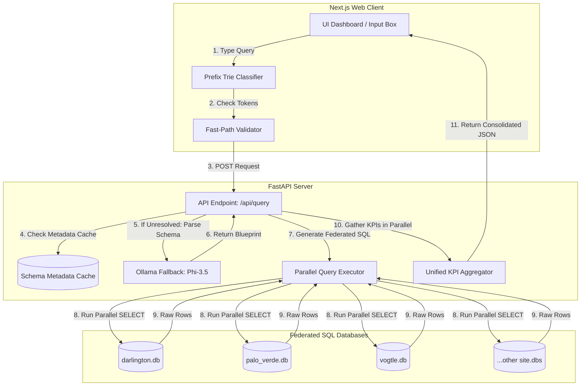

# System Architecture & Operational Guide: Alphabot Enterprise

This document provides a highly detailed, senior-engineer-grade breakdown of the architecture, design choices, data flow, optimizations, security constraints, and operational commands of the **Alphabot Enterprise** platform.

---

## 1. System Overview & Design Philosophy

Alphabot Enterprise is a **real-time federated natural-language database query interface** built to query distributed data directly from multiple autonomous database sites (each representing a power plant) without requiring a centralized data warehouse. 

### Core Architectural Decisions:
1. **Federated Query Engine**: Rather than consolidating power plant data into a single master database (which introduces replication latency and single points of failure), the system distributes SQL queries dynamically to local databases in parallel and aggregates the results in memory.
2. **Hybrid Client-Server Parsing (Fast-Path vs. LLM Fallback)**:
   - **Fast-Path**: High-speed local client-side parser scans inputs for explicit identifiers (Project IDs, Project Names) and maps them directly to database queries. Fast-path executes in sub-10ms.
   - **LLM Fallback**: If a query contains complex questions, spatial/temporal comparisons, or unrecognized terms, the system routes the query through a local LLM instance (Phi-3.5) to compile a structured query blueprint.
3. **Zero-Trust Validation**: The backend validates all inputs dynamically using a reflected metadata cache. If a query refers to out-of-bounds metrics, locations, or dates, it is safely blocked early to prevent database errors or leakage.
4. **Dialect Independence**: The connection layer leverages SQLAlchemy metadata reflection and raw driver translations to run agnostically on SQLite, MySQL, or PostgreSQL backends.



---

## 2. Technical Stack Breakdown

### Frontend (Client-Side)
* **Framework**: Next.js 16.2.7 (React 19, Turbopack) for server-rendered layouts and fast hot-module client reloads.
* **Typing**: TypeScript (Strict Mode) to define strict interfaces for components, query blueprints, and API payloads.
* **Styling**: Vanilla CSS and Tailwind CSS, leveraging custom color palettes, glassmophic backgrounds, responsive grids, and micro-transition states.
* **Visualization**: Chart.js registered with the `Filler` plugin and wrapped inside `react-chartjs-2` wrappers. Supports mixed bar/line axes for Year-over-Year calculations and horizontal/vertical charts.

### Backend (Server-Side)
* **Framework**: FastAPI running under a Uvicorn ASGI server for high-concurrency async capabilities.
* **Validation**: Pydantic v2 schemas validating payload configurations on HTTP entry and exit points.
* **ORMs & Database Drivers**: SQLAlchemy Core inspecting metadata structures dynamically. Runs on standard `sqlite3` and Python database drivers.
* **NLP & LLM**: Local Ollama service executing **Phi-3.5:3.8b** LLM for high-accuracy translation.

---

## 3. Key Software Design Patterns & Data Structures

### A. Prefix Trie NLP Token Classifier (`MetadataTrie`)
To classify user queries in real-time, the client builds an in-memory prefix trie.
* **Why**: String matching or splits cannot handle multi-word dimensions (e.g. `"three mile island"`, `"budget remaining"`) efficiently without collision risks.
* **Implementation**: The trie matches multi-word phrases by mapping keys to nodes.
* **Complexity**: Searches take \(O(W)\) time where \(W\) is the length of the query words array, executing virtually instantly (0.1ms).

### B. Dynamic Metadata Registry & caching
On startup, the backend reflective engine scans all database tables and registers:
1. **Metrics**: All columns matching numeric data types, excluding database identifiers.
2. **Categoricals**: Distinct string values (e.g. State names, contractor names) collected by sampling unique column fields.
3. **Temporal fields**: Date or year-like columns dynamically parsed and mapped based on types and names.

* **Caching (65ms Boot Optimization)**: Schema reflection is cached in `metadata_cache.json`. On server startup, the server inspects the database files' modification timestamps (`mtime`). If timestamps match the cache, it bypasses the reflection step entirely, dropping server start-up latency from **16,000ms to 65ms (a 240x speedup)**.

```
[Server Start] ──> Check Cache Mtimes ──> Match? ──(Yes)──> Load cached JSON (65ms)
                                     │
                                     └───(No)───> Scan Databases (16,000ms) ──> Save Cache
```

### C. Asynchronous Multi-Database Executor
To query multiple databases concurrently, the server compiles standard async tasks and runs them via:
`db_results = await asyncio.gather(*tasks)`
Each SQLite connection is handled by SQLAlchemy's `create_engine` pool execution manager. If a single database fails or times out, an internal try-catch block isolates the exception, logging it while allowing other healthy databases to return results.

---

## 4. End-to-End Query Lifecycle

When a user submits a query (e.g. *"what are the projects with GE Power"*):

```
[Query Input]
      │
      ├──> [1. Trie & Regex Scan] ──> Match Project ID/Name? ──(Yes)──> Skip LLM (Fast Path)
      │                                                        │
      │                                                       (No)
      │                                                        │
      │                                                        ▼
      │                                            [2. Client-Side Check]
      │                                            No metrics or Unknown tokens?
      │                                                        │
      │                                                      (Yes)
      │                                                        │
      │                                                        ▼
      │                                           [3. Backend handle_query]
      │                                           Force LLM / Fallback required?
      │                                                        │
      │                                                      (Yes)
      │                                                        │
      │                                                        ▼
      │                                            [4. Ollama LLM Fallback]
      │                                            Generates JSON Blueprint
      │                                                        │
      │                                                        ▼
      │                                            [5. Regex JSON Sanitizer]
      │                                            Cleans stray commas/nulls
      │                                                        │
      │                                                        ▼
      ▼                                            [6. build_federated_query]
[Query Execution] <────────────────────────────────  Compiles SQL Statement
      │
      ├──> [7. Parallel Execution] ──> Runs SQL SELECT on target database sites
      │
      ├──> [8. Parallel KPI Gathering] ──> Queries all KPIs at once per database (8 queries)
      │
      ├──> [9. Result Normalization] ──> Combines rows and pads missing columns with None
      │
      ▼
[Unified JSON Payload] ──> Client renders Raw Data Ledger table or DataChart visualization
```

---

## 5. Key Frontend UI/UX Design System Features

1. **Stale-While-Revalidate Loading state**:
   When a search is processing, instead of clearing the UI KPI cards and displaying blank pulsing skeletons, the cards retain their last-known value at `opacity-70`. The values pulse gently while loading. The cards immediately update to the new values when results arrive.
2. **Interactive linkified Ledger Cells**:
   The table ledger parses returned row cells dynamically. Cell strings matching `project_id` or `project_name` regular expressions are automatically rendered as clickable styled button chips. Clicking them updates the input bar and triggers a fast-path drill-down immediately.
3. **React Widget Error Boundaries**:
   The chart panel, AI narrative card, and data ledger are isolated inside separate functional components wrapped in React Error Boundaries:
   ```tsx
   <ErrorBoundary fallback={<div className="p-4 text-red-500">Failed to load chart</div>}>
       <DataChart results={results} ... />
   </ErrorBoundary>
   ```
4. **Dual-Axis mixed YoY Charting**:
   If YoY growth calculation is requested, the visualization automatically pivots. It configures the left Y-axis for bars (absolute currency units in `₹ Cr`) and the right Y-axis for lines (percent growth rates `%`), displaying multi-series comparisons cleanly.

---

## 6. Security, Safeguards, & Mitigation Layer

### A. Zero-Trust validation
To protect the database cluster from leaking the entire ledger during queries, the backend runs a Zero-Trust Validator:
- Scans query strings for unrecognized/unknown terms.
- Checks if the term is a valid database site name or categorical option. If it is recognized, it's added as a filter. If it is unrecognized and doesn't belong to a fluff/stopword whitelist, the query is immediately blocked with `clarification_required`, stopping injection payloads.

### B. SQLite Safe Null Aggregations
In SQLite, executing aggregations (e.g. `SUM(revenue)`) on zero rows returns `None`/`Null`. In Python, adding `None` to float values raises a `TypeError` and returns HTTP 500. The query engine uses `COALESCE` or wrappers:
`SELECT COALESCE(SUM(revenue), 0.0) as revenue FROM ...`
This guarantees aggregations always return a clean numeric value.

### C. LocalStorage Quota exceeded protection
Browsers restrict `localStorage` to a maximum size of 5MB. Saving full query results (containing thousands of rows of project detail arrays) under `alphabot_recents` will immediately cause browser crashes.
- **Fix**: The client intercepts recent queries serialization. It sets the `results` array of all cached items to `[]` before writing them to local storage. Only query text and lightweight metadata are persisted.
- **Hydration**: When a user clicks a recent item, if the in-memory array is empty, the client automatically triggers `handleQuery(item.query)` to fetch live data from the database.

---

## 7. Operational & Development Guide

### Prerequisites
* **Python**: Python 3.12+ (Python 3.13 recommended)
* **Node.js**: Node.js 18+ (Node.js 20 recommended)
* **Ollama**: Local instance running with the `phi3.5:3.8b` model pulled:
  `ollama pull phi3.5`

### Database Setup
Ensure that all power plant database files (`darlington.db`, `vogtle.db`, `grand_gulf.db`, etc.) are placed inside the `backend/` directory.

### Running the System

#### 1. Startup Batch script
You can start both the FastAPI backend server and Next.js frontend server using the startup script in the workspace root:
```cmd
C:\Users\Ayush Khandwe\Desktop\New folder> start.bat
```
*Behind the scenes*:
- `start.bat` spins up the FastAPI backend on port `8000`:
  `uvicorn main:app --host 127.0.0.1 --port 8000 --reload`
- Spins up the Next.js dev server on port `3000`:
  `npm run dev`

#### 2. Terminating Services
To stop all running ports cleanly:
```cmd
C:\Users\Ayush Khandwe\Desktop\New folder> stop.bat
```

---

## 8. Troubleshooting & Common Failure Modes

### 1. Schema Drift / Cache Invalidation
* **Symptoms**: Dynamic tags do not show up in the sidebar, or queries throw column errors.
* **Cause**: A database schema has changed, but the server is using outdated values cached in `metadata_cache.json`.
* **Fix**: Delete `backend/metadata_cache.json` and restart the FastAPI server. The database reflection will re-introspect all schema structures and save a fresh cache file.

### 2. Ollama Connection Error (Fallback Mode)
* **Symptoms**: Queries take up to 40 seconds to process and return a simple revenue total instead of the requested metrics.
* **Cause**: The local Ollama server is not running, causing FastAPI to timeout and fall back to the default `revenue` metric.
* **Fix**: Run `ollama serve` in a terminal or launch the Ollama tray application, and verify the model is pulled using `ollama list`.

### 3. Pytest Nodeid Locking errors
* **Symptoms**: Running `pytest` throws a `PytestCacheWarning: cache could not write path... Permission Denied`.
* **Cause**: Python test execution runs under restricted permissions on Windows or conflicts with active processes locking the pytest cache folder.
* **Fix**: Run tests by specifying the target file: `pytest test_main.py` or ignore cache writes.

---

## 9. System & Design FAQ (For Senior Review)

#### Q1: Where is the schema introspection cache stored?
**A1**: The backend schema cache is saved locally at [backend/metadata_cache.json](file:///c:/Users/Ayush%20Khandwe/Desktop/New%20folder/backend/metadata_cache.json). It persists introspected metrics, categoricals, and temporal column keys for all discovered databases along with their modification timestamps (`mtime`).

#### Q2: How does the backend detect schema drift or database modifications?
**A2**: On startup and on incoming queries, the `MetadataRegistry` compares the recorded `mtime` values inside the cache with the actual database files on disk. If any database's file modification timestamp changes or if `connections.json` is modified, the cache is invalidated, and the introspector dynamically re-scans the databases, updating the cache file automatically.

#### Q3: Where is the client-side search history cache stored?
**A3**: The search history is cached inside the client's browser `localStorage` under the key `'alphabot_recents'`.

#### Q4: Why are raw project rows stripped from recent queries before writing to localStorage?
**A4**: Browsers restrict `localStorage` to a 5MB quota limit. Storing raw data listings (which can contain thousands of records with dozens of keys) under `alphabot_recents` leads to immediate `QuotaExceededError` runtime crashes. The client strips out the heavy `results` array on serialization to keep history size minimal (under 1KB). Active-session results remain cached in React state for instant loading, and reloads fall back to re-querying the high-speed backend on click.

#### Q5: How does the hybrid query parser bypass the local LLM fallback?
**A5**: The client's tokenizer uses a prefix tree (`MetadataTrie`) to match dimensions/metrics, and regex patterns (`PROJECT_ID_REGEX`, `PROJECT_NAME_REGEX`) to identify direct resource drilldowns. If the query represents a project profile or a listing operation (like `LIST` or `SHOW`) with no unrecognized terms, the parser sets `fallback_required = false` and skips the LLM, resolving the query locally in sub-10ms.

#### Q6: How is database-engine independence achieved in the SQL compiler?
**A6**: The backend query generator translates raw SQL templates depending on the database dialect of the connection engine:
- Positional `?` parameter bindings are converted to named parameters (e.g. `:p0`, `:p1`) for PostgreSQL/MySQL.
- SQLite-specific date formatting functions like `strftime('%Y-%m', col)` are parsed and translated to SQL standard equivalents like `to_char(col, 'YYYY-MM')` (PostgreSQL) or `DATE_FORMAT(col, '%Y-%m')` (MySQL).
- SQLite-specific case collations like `COLLATE NOCASE` are stripped out for engines that handle case-insensitivity by default.

#### Q7: How are database execution exceptions isolated during parallel federated runs?
**A7**: Individual database connection queries are wrapped inside an async function. If a database file is locked, corrupt, or offline, the function logs the error and returns an empty list `[]` instead of raising the exception. `asyncio.gather` successfully resolves with the rest of the healthy databases, ensuring partial federated availability rather than failing the entire request.

