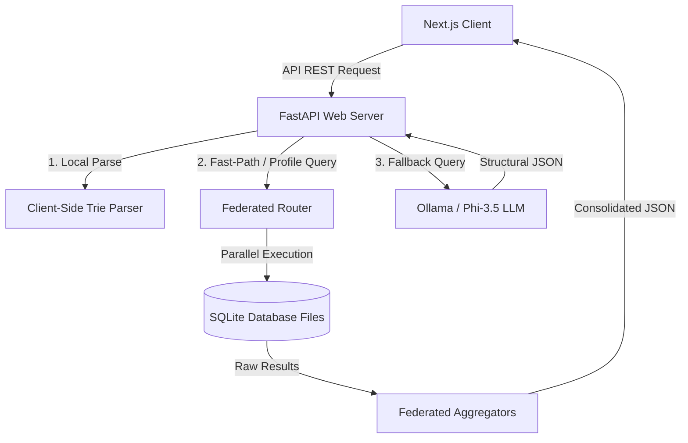

# Alphabot Enterprise: Technology Stack & Architecture Document

This document provides a comprehensive technical guide to the architecture, frameworks, libraries, and design patterns utilized in the Alphabot Enterprise federated analytics system.

---

## 1. System Architecture Overview

Alphabot Enterprise uses a **Hybrid Federated Natural Language Query Pipeline** to translate English queries into high-performance SQL executions distributed across multiple autonomous databases.

---

## 2. Frontend Technology Stack

The frontend is a modern, responsive single-page application built using modern web design principles (glassmorphic visual cues, dark modes, and transition micro-animations).

### Core Framework & Language
* **Next.js 16 (React 19, Turbopack)**: Utilized for client-side routing, static optimizations, and rendering component states.
* **TypeScript (v5)**: Enforces compile-time type-safety across props, API request/response payloads, and client-side schemas.

### Visualization & Styling
* **Tailwind CSS**: Used for modern utility styling, custom HSL colors, responsive grid structures, dark-mode styling, and transitions.
* **Chart.js & react-chartjs-2**: Renders dynamic, responsive visualizations including:
  - Multi-series grouped comparisons (bar, line, and doughnut layouts).
  - Dual-axis Year-over-Year (YoY) charts combining line-based growth percentages and bar-based absolute figures.

### Client-Side NLP Classifier (`engine.ts`)
* **Prefix Trie Algorithm**: A custom prefix-tree (`MetadataTrie`) scans query inputs in real-time, resolving keywords and multi-word phrases (e.g. `palo verde`, `budget remaining`) to dimensions or metrics in \(O(W)\) time (where \(W\) is word length).
* **Regex Fast-Path Parser**:
  - `PROJECT_ID_REGEX` matches structures like `PRJ-[A-Z]+-\d+`.
  - `PROJECT_NAME_REGEX` matches structures like `<site> <type> unit <number>`.
  - Bypasses LLM translation for direct profile drill-down queries, achieving sub-10ms processing latency.

### Resiliency & Fault Isolation
* **React Error Boundaries**: Visual widgets (charts, ledgers, blueprints) are wrapped in functional Error Boundaries to isolate rendering failures and prevent app crashes.
* **Request Timeout Guards**: Uses the browser's `AbortController` API to terminate lagging API fetch calls after a strict 15-second timeout window.

---

## 3. Backend Technology Stack

The backend is a lightweight, asynchronous API service engineered to handle schema discovery, query routing, database federation, and LLM translations.

### Core Web Framework
* **FastAPI (Python 3.13)**: High-performance ASGI framework powered by Starlette and Uvicorn.
* **Pydantic v2**: Enforces strict JSON serialization, deserialization, and schema validation on API request-response boundaries.

### Asynchronous Federated Engine
* **Python asyncio**: Executes read queries in parallel across multiple database targets using `asyncio.gather()`.
* **Dynamic Schema Discovery & Reflection**: The `MetadataRegistry` scans SQLite databases dynamically, reading column types to classify metrics (numerical) and dimensions (categorical), and sampling distinct values for fuzzy matching.

### Query Parser & Router (`main.py`)
* **Levenshtein Fuzzy Matching**: Automatically resolves typo errors or unknown query segments (e.g., matching `"gujrat"` to `"Gujarat"`) within a distance threshold of 1 or 2 characters.
* **Targeted Site Routing**: Inspects filters inside the query blueprint (e.g. project name or project ID prefix) to target a specific database file, avoiding redundant execution across other databases.
* **Case-Insensitive Collation**: Injects `COLLATE NOCASE` into SQLite where-clauses for text-based matching (e.g. `project_name COLLATE NOCASE = ?`), ensuring user queries match mixed-case database entries seamlessly.

---

## 4. Database Federation & SQL Engine

The data layer represents a federated cluster of databases without a single consolidated warehouse.

* **SQLite Engine**: Used as the embedded database engine. Each power plant location has its own independent `.db` file (e.g., `darlington.db`, `vogtle.db`).
* **Safe Null Aggregations**: Implements SQL wrapper functions ensuring zero-row aggregate queries (e.g., `SUM(revenue)`) return `0.0` instead of `None`/`Null`, preventing server type exceptions.
* **Parameter Interpolation Trace**: The query engine resolves binding parameters safely (protecting against SQL injection) and outputs the final executed query string (`raw_sql_query`) to the frontend pipeline tracer.

---

## 5. Local LLM Hybrid Translation

For queries containing complex logic or temporal parameters, a local LLM fallback is triggered.

* **Ollama API Integration**: Communicates with a local Ollama instance running the **Phi-3.5:3.8b** LLM.
* **Dynamic Context Injection**: The schema reflected by the `MetadataRegistry` is dynamically compiled and injected into the LLM system prompt. The LLM acts schema-aware, translating natural query intent into standard JSON plans on the fly.
* **Regex JSON Sanitizer**: Pre-processes raw LLM responses to clean up trailing commas, unescaped quotes, or stray `null` values before passing the payload to the Pydantic parser.

---

## 6. Test & Quality Assurance Framework

* **pytest**: Runs the unit and integration test suite, executing mock database query assertions.
* **Hermetic Setup Fixture**: Configures the `MetadataRegistry` with mock metrics and categoricals in `setup_and_teardown_for_tests` to isolate tests from local database modifications.
